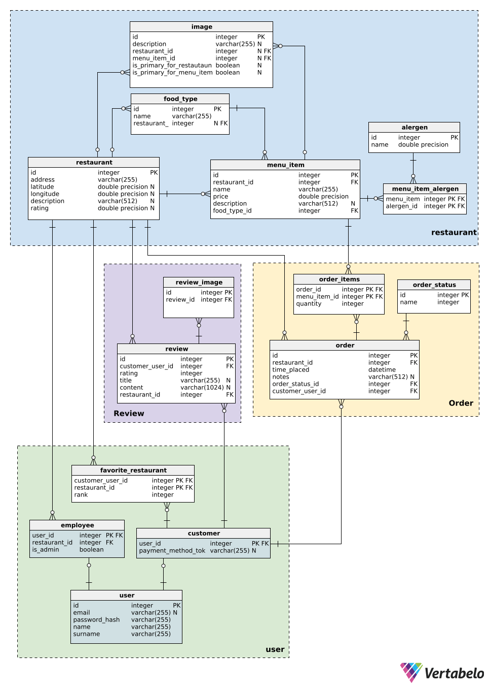

# 🎓 **Our Baller Thesis**

Welcome to the repository for our thesis! Below are the key resources to help you navigate our project.

## 🗂️ **Quick Links**
- 📋 [**Project Management Board**](https://www.notion.so/18f8b4fe95688005b1f9e1fd46df94ff?v=18f8b4fe9568809dbb68000c6e55a492&pvs=4)
- 📄 [**Documentation**](https://docs.google.com/document/d/1GfDUPtL-NAAx4kYY9g9sp-yzu_g05wHX5Sq4E4YY3JI/edit?usp=sharing)
- 🎨 [**UI Mockups**](https://www.figma.com/design/Igz4UEVpdrHuY3GvXdLcP7/PRO-Mockup?node-id=0-1&t=hDBrVikHh4A4u62W-1)
- 🔌 [**Endpoints**](https://docs.google.com/document/d/1E955BQFnevlgxs8YLM71R924gzzgWy1Xd2LhYZYi-ic/edit?usp=sharing)
- 🗺️ [**Lucdichart**](https://lucid.app/lucidchart/598bdabb-3a0e-4ad1-8daf-9b95e059ef49/edit?viewport_loc=-7883%2C-1292%2C3068%2C1420%2C0_0&invitationId=inv_233120c5-a944-4b79-8ae4-d14f9602685f)

## 🗂️ **ER Diagram**


### **Here are some fun facts about the **Ankylosaurus**, one of the coolest dinosaurs around:**

```plaintext
                      /~~~~~~~~~~~~\_
   _+=+_             _[~  /~~~~~~~~~~~~\_
  {""|""}         [~~~    [~   /~~~~~~~~~\_
   """:-'~[~[~"~[~  ((++     [~  _/~~~~~~~~\_
        '=_   [    ,==, ((++    [    /~~~~~~~\-~~~-.
           ~-_ _=+-(   )/   ((++  .~~~.[~~~~(  {@} \`.
                   /   }\ /     (     }     (   .   ''}
                  (  .+   \ /  //     )    / .,  """"/
                  \\  \     \ (   .+~~\_  /.= /'""""
                  <"_V_">      \\  \    ~~~~~~\\  \
                                \\  \          \\  \
                                <"_V_">        <"_V_">
```


1. **Armored Tank**: Ankylosaurus was heavily armored with thick, bony plates (osteoderms) and spikes that protected it from predators like T. rex. It was like a walking tank!

2. **Tail Club**: Its tail ended in a massive, bony club, which it used to defend itself by swinging it at attackers. The force of a swing could break bones!

3. **Herbivore**: Despite its tough appearance, Ankylosaurus was a peaceful plant-eater, feeding mostly on low-lying vegetation like ferns and shrubs.

4. **Cretaceous Period**: Ankylosaurus lived around 66 million years ago during the late Cretaceous period, near the end of the dinosaurs' reign.

5. **Low Profile**: Ankylosaurus had a low, squat body, making it difficult for predators to flip it over—its only vulnerable spot was its soft underbelly.

6. **Large but Slow**: It weighed up to 8 tons and was about 20–26 feet long, but its heavy armor made it slow-moving.

7. **Well-Camouflaged**: The bony plates may have also helped it blend into its surroundings, acting like natural camouflage in its environment.

8. **Tiny Brain**: Ankylosaurus had a very small brain compared to its body size, meaning it wasn't the most intelligent of dinosaurs, but it didn’t need to be—it was built for defense!

Ankylosaurus is often compared to an ancient tank due to its robust defense mechanisms, making it a fascinating dinosaur for its sheer strength and survival strategy!
